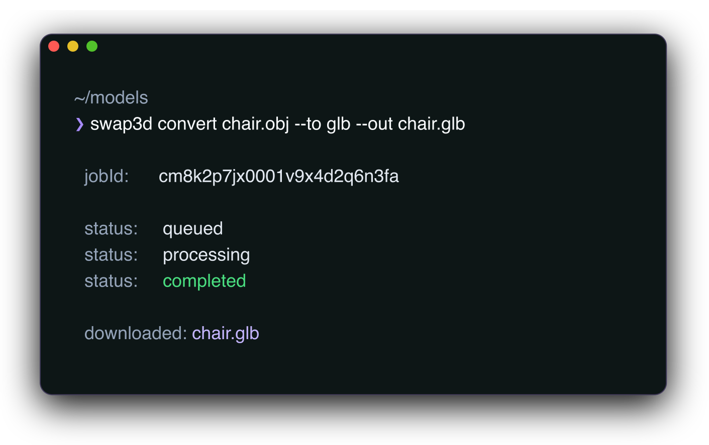

<h1 align="center">Swap3D CLI</h1>

<p align="center">Convert 3D files from your terminal with the Swap3D developer API.</p>

<p align="center">
  <a href="https://www.npmjs.com/package/@swap3d/cli"></a>
  <a href="https://github.com/swap3d/swap3d-cli/actions/workflows/test.yml"></a>
  <a href="LICENSE"></a>
</p>

<p align="center">
  <a href="https://swap3d.studio">Website</a> ·
  <a href="https://swap3d.studio/developer-api">Documentation</a> ·
  <a href="https://github.com/swap3d/swap3d-cli/releases/latest">Releases</a>
</p>

<p align="center">
  <a href="https://swap3d.studio/developer-api">
    
  </a>
</p>

---

## Quickstart

### Install Swap3D CLI

Run the following on macOS or Linux:

```shell
curl -fsSL https://swap3d.studio/install.sh | sh
```

Run the following in Windows PowerShell:

```powershell
powershell -NoProfile -ExecutionPolicy Bypass -c "irm https://swap3d.studio/install.ps1 | iex"
```

The standalone installers do not require Node.js. They select the correct
binary for your platform, verify its SHA-256 checksum, and install it without
administrator privileges.

Swap3D CLI is also available through npm and Homebrew:

```shell
# Install using npm (Node.js 18 or newer)
npm install -g @swap3d/cli

# Install using Homebrew
brew install swap3d/tap/swap3d
```

You can run the npm package without installing it globally:

```shell
npx @swap3d/cli formats
```

<details>
<summary>Download a standalone binary from GitHub Releases</summary>

The [latest GitHub Release](https://github.com/swap3d/swap3d-cli/releases/latest)
includes:

- macOS
  - Apple Silicon: `swap3d-darwin-arm64.tar.gz`
  - Intel: `swap3d-darwin-x64.tar.gz`
- Linux
  - x64 glibc: `swap3d-linux-x64.tar.gz`
  - x64 musl: `swap3d-linux-x64-musl.tar.gz`
  - arm64 glibc: `swap3d-linux-arm64.tar.gz`
  - arm64 musl: `swap3d-linux-arm64-musl.tar.gz`
- Windows
  - x64: `swap3d-windows-x64.zip`
  - arm64: `swap3d-windows-arm64.zip`

Verify manual downloads against the `SHA256SUMS` file in the same release.

</details>

### Convert your first model

Create an API key in the [Swap3D dashboard](https://swap3d.studio/dashboard/api),
then save it locally:

```shell
swap3d auth login --api-key <your-api-key>
```

Convert a model:

```shell
swap3d convert ./model.obj --to glb --out ./model.glb
```

Swap3D uploads the source file, waits for the asynchronous conversion to
finish, and downloads the result to the requested path.

For CI and other non-interactive environments, provide the key without writing
a local config file:

```shell
SWAP3D_API_KEY=<your-api-key> \
  npx @swap3d/cli convert ./model.obj --to glb --out ./model.glb
```

## Commands

| Command | Description |
| --- | --- |
| `swap3d auth login` | Save an API key and optional API URL |
| `swap3d auth status` | Show the active authentication configuration |
| `swap3d auth logout` | Remove the saved API key |
| `swap3d convert` | Submit a conversion and download the result |
| `swap3d job status` | Check an asynchronous conversion job |
| `swap3d job download` | Download a completed conversion |
| `swap3d usage` | Show the current plan and monthly API usage |
| `swap3d formats` | Show supported formats and the upload limit |

Run `swap3d --help` for command syntax.

## Authentication

Swap3D CLI resolves credentials in this order:

1. `--api-key`
2. `SWAP3D_API_KEY`
3. the key saved by `swap3d auth login`

Saved configuration lives at `~/.config/swap3d/config.json`. The CLI writes
the file with `0600` permissions on supported platforms.

The default API endpoint is:

```text
https://api.swap3d.studio/api/v1
```

Override it with `--api-url`, `SWAP3D_API_URL`, or the value saved during
`swap3d auth login`.

## Automation

Use `--json` for machine-readable output:

```shell
swap3d usage --json
swap3d job status <job-id> --json
```

Submit a job without waiting for it:

```shell
swap3d convert ./model.obj --to glb --no-wait --json
```

Then inspect or download it later:

```shell
swap3d job status <job-id> --json
swap3d job download <job-id> --out ./model.glb
```

## Formats And Limits

Run the following to read current capabilities from the API:

```shell
swap3d formats
```

Use `swap3d formats --offline` to display the CLI's built-in capability
metadata without making a network request.

The current API accepts source files up to 100 MB and converts to GLB or glTF
variants. The live `formats` command is the source of truth as capabilities
evolve.

## Installation Options

Install a specific standalone version or choose another directory:

```shell
curl -fsSL https://swap3d.studio/install.sh |
  sh -s -- --version 0.2.3 --install-dir "$HOME/.local/bin"
```

PowerShell supports the equivalent parameters:

```powershell
$env:SWAP3D_VERSION = "0.2.3"
$env:SWAP3D_INSTALL_DIR = "$HOME\bin"
irm https://swap3d.studio/install.ps1 | iex
```

Upgrade Homebrew installations with:

```shell
brew upgrade swap3d
```

## Contributing

Contributions are welcome. Read [CONTRIBUTING.md](CONTRIBUTING.md) before
opening a pull request. Use [GitHub Issues](https://github.com/swap3d/swap3d-cli/issues)
for bugs and feature requests, and follow [SECURITY.md](SECURITY.md) for
vulnerability reports.

## License

This repository is licensed under the [Apache-2.0 License](LICENSE). See
[NOTICE](NOTICE) for attribution information.
